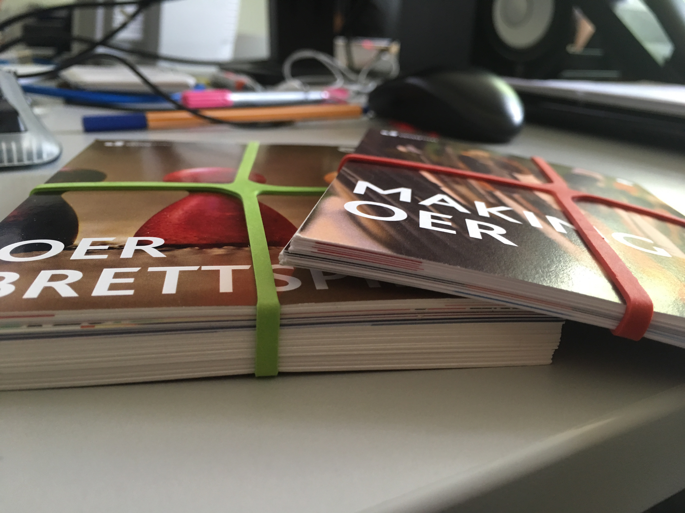
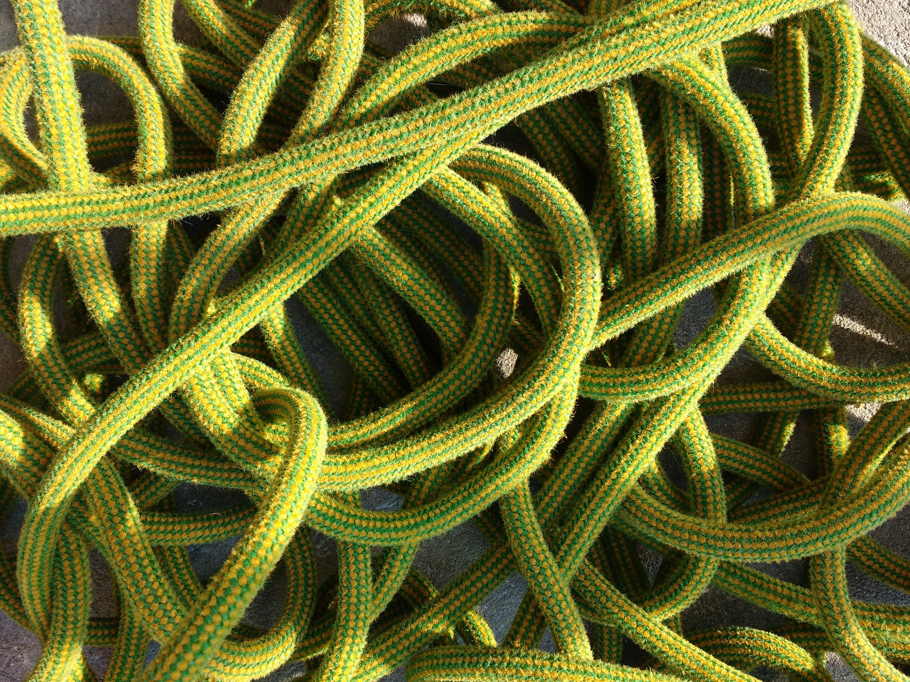

# JFMH 2017
 
Eine Kurzdarstellung

---

## [ AGENDA ]

 
### 1 Erkenntnisse
### 2 Tools
### 3 Sonstiges.</li>

---
# [ ERKENNTNISSE ]

+++
## OER sind ein ambivalentes Thema.
***
 
Debatte darum, ob OEP ein Teil von OER seien, oder etwas davon getrenntes.  
OER als Material |
OER als Mindset

+++
## OEP als diskursives Feld.
***
 
Spannender Workshop von @danderlan und @franziskalinke, in dem ich wieder gemerkt habe, wie viel Spaß es macht Forschungsgegenstände zu rekonstruieren. In diesem Fall über Tweets die OEP thematisieren.

+++
## Flipped Classroom ist noch nicht so richtig angekommen

Nur ein Bruchteil der TeilnehmerInnen hatten sich die Videos angeschaut.

+++
Partizipation im Etherpad war jedoch sehr gut (thx insb. @m_andrasch) und erkenntnisreich. 
####[Link zum Etherpad](https://pad.hs-wismar.de/p/jfmh17).

---
# [ TOOLS ]

+++
## [ VOSviewer ]
***
 
Freies Tool zur Visualisierung von Daten  
Cluster |
Heatmaps 
####(thx @sozmethode)

+++
## [ GitBook und GitPitch ]
***
 
Produktive Szenarios für Text und Präsentationsdokumente (thx @xldrkp von der TUHH).  
Plädoyer für das Experimentieren und Ausprobieren von GitLab neben "klassischen" LMS-Anwendungen. Vorteil: Ermöglichung neuer mediendidaktischer Szenarien.

+++
## [ Print hat auch noch eine Zukunft ]
***
Uni Siegen: Postkartenformat für allgemeine OER-Weiterbildung (thx @[Alexander Schnücker](http://hd.uni-siegen.de/oerhd/?lang=de) ).

---
# [ SONSTIGES ]
***

Was mir noch so auf- und eingefallen ist.

+++
## [ Vages ]
***
 
~QPL ist allgegenwärtig.~ Die Blockchain ist allgenenwärtig.    Zukunft ungewiss.

+++
## [ Open Science ]
***
 
Digital Methods müssen vor dem Hintergrund von Open Science sowie forschungsethischer Standpunkte betrachtet werden.

+++

---

ENDE DER VORSTELLUNG
